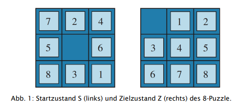

# Aufgabenblatt 2

## Aufgabe 1
### Welche Parität hat der Zustand S in Abb. 1 ?
7, 2, 4, 5, 6, 8, 3, 1
 
(1, 2), (1,3), (1,4), (1,5), (1,6), (1,7), (1,8), (2, 7), (3, 4), (3, 5), (3, 6), (3,7), (3, 8), (4, 7), (5, 7), (6, 7)
 
16 Paare => Parität gerade.

### Implementieren Sie eine Funktion zur Berechnung der Parität eines Zustands
Siehe calculate_Parity in Board.java

## Aufgabe 2
### Für einen Zustand z ist h1(z) die Anzahl der falsch platzierten Steine in Bezug auf den Zielzustand. In Abb. 1 ist h1(S) = 8. Wieso ist h1 eine monotone Heuristik?
Durch einen Zug von einem Stein kann die Heuristik maximal +1, -1 oder gleichbleibend verändert werden. Durch den Schrittwechsel ist die Formel h(n) <= 1 + h(n’) immer erfüllt.

### Für einen Zustand z ist h2(z) die Summe der Manhattan-Distanzen der Steine von ihren Zielpositionen. In Abb. 1 ist h2(S) = 3 + 1 + 2 + 2 + 2 + 3 + 3 + 2 = 18. Wieso ist h2 eine monotone Heuristik?
h2 ist eine monotone Heuristik, da Sie bei einem Zug nicht kleiner werden kann, da immer der Schiebe-Schritt berücksichtigt werden muss. Betrachtet wird hier die alte Heuristik(h2(z)) mit h2(z) <= 1 + h2(z’) wobei h2(z’) (der nächste Zustand) nur den Wert von h2(z) +/- 1 annehmen kann.

### Wieso ist h1(n) ≤ h2(n)? Welche Heuristik ist also besser?
h1(n) ist immer kleiner gleich als h2(n), da bei h1(n) nur die Anzahl der flaschen Steine berücksichtigt wird, währenddessen bei h2(n) die Distanz des Steins zur richtigen Position betrachtet wird.
Folie 77, 02_ProblemLösenDurchSuchen
 
Die Heuristik von h2(n) ist besser. Die Differenz (h*(n) - h2(n)) ist dabei kleiner als ( h*(n) - h1(n)) und somit schärfer. Als Konsequenz ist die Suche auch zielgerichteter.
(h*(n) ist der tatsächliche Weg zum Ziel)

### Implementieren Sie beide Heuristiken.
Siehe heuristik1 / heuristik2 in Board.java

## Aufgabe 3
### Implementieren Sie Suchverfahren für das 8-Puzzle in zwei Varianten
Siehe A_Star.java für A* suche und IDFS für Iterative deepening depth-first search IDS

### Testen Sie Ihre Suchverfahren für zufällig generierte Startzustände. Beachten Sie dabei die Paritätsüberlegung in Aufgabe 1.
Run Puzzle8.java
### Bestimmen Sie die Anzahl der vom Suchverfahren generierten Zustände und die Länge der Lösungsfolge für verschiedene Startzustände.
?
### Sind Ihre Zugfolgen optimal? Wenn ja, warum?
- A*: Die Hauptmerkmale von A* sind es ist vollständig und optimal. Falls es ein Weg von S nach Z existiert, wird dieser auch gefunden (vollständig). Der gefundene Weg ist ein kürzester Weg (optimal)
- IDFS: Da jede Aktion die gleichen positiven Kosten hat und der Algorithmus immer Ebenenweise sucht, wird die schnellsmögliche Lösung gefunden. (Hat Prof. Bittel an Tafel erklärt)

### Welches Problem könnte entstehen (nicht ausprobieren!), falls A* für die Lösung des 15- Puzzle eingesetzt werden würde?
Evenutell zu Speicherproblemen weil die Closed und OpenList sehr gefüllt werden da jeder Knoten besucht wird ?